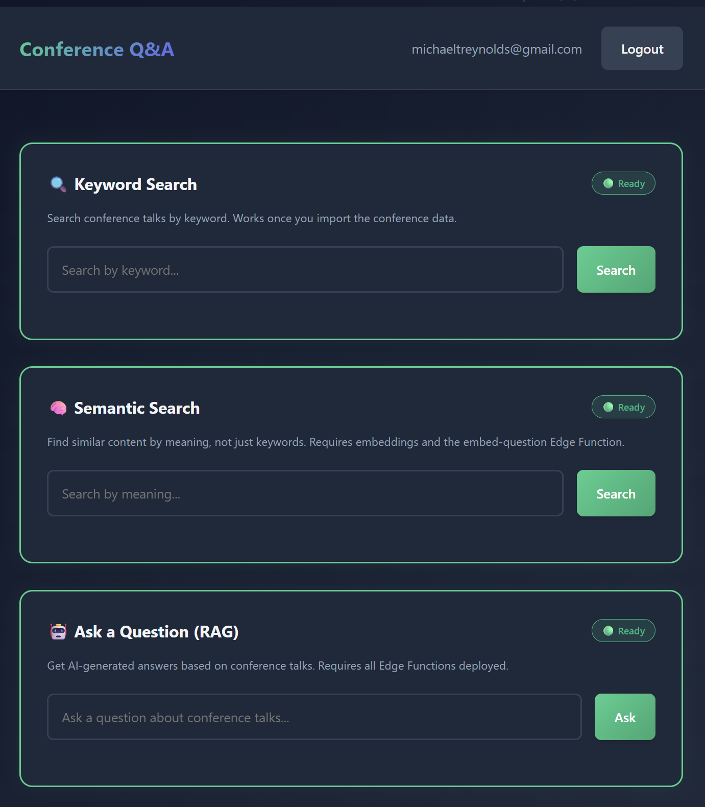

# Conference RAG

A Retrieval Augmented Generation (RAG) application that lets users ask questions about General Conference talks using semantic search and AI-generated answers.

**Live Demo**: [https://michaeltreynolds.github.io/cragger/](https://michaeltreynolds.github.io/cragger/)

<p align="center">
  
  <br>
  <em>Sample screenshot — semantic search with AI-generated answers</em>
</p>

## 🚀 Quick Start

Follow the step-by-step guides in the `steps/` folder:

| Step | Topic | Time |
|------|-------|------|
| [00](steps/00_overview.md) | Overview & Environment Setup | 15 min |
| [01](steps/01_fork_and_setup.md) | Fork Repo & Install Dependencies | 10 min |
| [02](steps/02_supabase_project.md) | Create Supabase Project | 10 min |
| [03](steps/03_database_schema.md) | Create Database Schema | 10 min |
| [04](steps/04_deploy_frontend.md) | Deploy to GitHub Pages | 15 min |
| [05](steps/05_edge_functions.md) | Deploy Edge Functions | 15 min |
| [06](steps/06_scrape_data.md) | Scrape Conference Talks | 10 min |
| [07](steps/07_embed_and_import.md) | Generate Embeddings & Import | 20 min |
| [08](steps/08_testing.md) | Test the System | 10 min |
| [09](steps/09_reflection.md) | Reflection & Deliverables | 10 min |

**Prerequisites:**
- [Supabase](https://supabase.com) account (free tier)
- [GitHub](https://github.com) account
- [OpenAI API key](https://platform.openai.com/api-keys) (~$0.60 usage)
- Python 3.9+
- An AI coding assistant (Antigravity, GitHub Copilot, or Cursor)

## 🤖 AI-Assisted Development

This assignment is designed to be completed with an AI coding assistant (Antigravity, GitHub Copilot, or Cursor). See [Step 00](steps/00_overview.md) for setup instructions.

Your AI assistant will automatically read [`ai_agent_instructions.md`](ai_agent_instructions.md) to understand the assignment's learning objectives and teach you along the way.

## 🏗️ Architecture

```
┌─────────────┐
│   Browser   │  Student asks question
│  (GitHub    │
│   Pages)    │
└──────┬──────┘
       │
       ├─── Supabase Auth (magic link)
       │
       ├─── Edge Function: embed-question
       │         ↓ OpenAI API (server-side 🔒)
       │         ↓ Returns embedding vector
       │
       ├─── Supabase Database (pgvector)
       │         ↓ match_sentences()
       │         ↓ Returns similar sentences
       │
       └─── Edge Function: generate-answer
                ↓ GPT-4o (server-side 🔒)
                ↓ Returns final answer
```

## 🔍 Three Search Modes

| Mode | What it does | Requires |
|------|-------------|----------|
| **🔍 Keyword Search** | SQL `ILIKE` query on talk text | Conference data imported |
| **🧠 Semantic Search** | Vector similarity with pgvector | Embeddings + `embed-question` Edge Function |
| **🤖 Ask a Question (RAG)** | AI-generated answers with sources | All Edge Functions deployed |

## 📁 Project Structure

```
conference-rag/
├── index.html                  # Main application UI
├── app.js                      # Three search modes + auth logic
├── styles.css                  # Dark theme styling
├── config.js                   # Supabase credentials (you edit this)
├── config.secret.json          # API keys & secrets (git-ignored)
├── config.secret.example.json  # Template for config.secret.json
├── requirements.txt            # Python dependencies
├── .nojekyll                   # Tells GitHub Pages not to use Jekyll
├── steps/                      # Step-by-step assignment guides
│   ├── 00_overview.md
│   ├── ...
│   └── 09_reflection.md
├── scripts/                    # Pipeline scripts (run in order)
│   ├── 01_create_schema.py     # Create DB schema
│   ├── 02_scrape_data.py       # Scrape conference talks → data/talks.json
│   ├── 03_embed_data.py        # Generate embeddings → data/sentences_with_embeddings.json
│   └── 04_import_data.py       # Import to Supabase
├── data/                       # Intermediate data (git-ignored)
└── supabase/
    └── functions/              # Edge Functions (deployed to Supabase)
        ├── _shared/            # Shared auth & CORS helpers
        ├── embed-question/     # Converts questions to embeddings
        └── generate-answer/    # Generates AI answers
```

## 🔒 Security Model

| Component | Security Approach |
|-----------|------------------|
| Supabase anon key | Safe to expose (protected by RLS) |
| OpenAI API key | Server-side only via Edge Functions |
| Database access | Row Level Security policies |
| Transport | HTTPS enforced by GitHub Pages |

## 📚 Learning Objectives

1. **Vector Embeddings** — Representing text as searchable numbers
2. **Semantic Search** — Finding similar content with cosine similarity
3. **RAG Architecture** — Combining retrieval + generation
4. **Edge Functions** — Serverless compute for secure API management
5. **Row Level Security** — User-level data access control
6. **Production Deployment** — Full-stack app on GitHub Pages

## 🎓 Assignment Deliverables

1. GitHub repository URL (your fork)
2. Live deployment URL (GitHub Pages)
3. Screenshot of a working query + answer
4. Written reflection on embedding strategies and AI-assisted development

## 🆘 Troubleshooting

| Issue | Solution |
|-------|----------|
| "Please configure Supabase" | Update `config.js` with your project URL and anon key |
| Magic link not working | Add your site URL to Supabase → Authentication → URL Configuration |
| Magic link email not arriving | Free tier allows only **3 per hour** — wait and try again, check spam |
| Changes don't appear | Hard refresh (Ctrl+Shift+R) or try incognito window |
| Search shows "Not Ready" | Complete the corresponding step first |
| "Failed to get embedding" | Deploy Edge Functions and set OPENAI_API_KEY secret |
| "Database search failed" | Run `scripts/01_create_schema.py` |
| No search results | Import data with `scripts/04_import_data.py` |

## 📄 License

Educational use only. Conference talk content is used under fair use for educational purposes.

---

Built with ❤️ for CS 452
